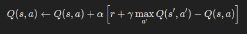
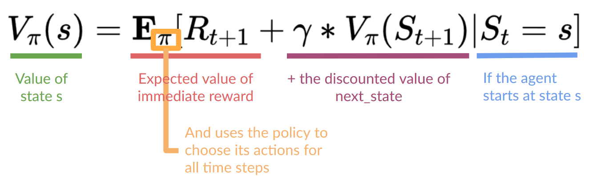

## Q Learning

Q-learning, temel bir pekiştirmeli öğrenme algoritmasıdır ve genellikle ajanların nasıl bir çevrede en iyi şekilde hareket edeceklerini öğrenmelerini sağlamak için kullanılır. Q-learning’in temel bileşenleri:

### 1. **Temel Kavramlar**

- **Agent:** Çevrede kararlar veren ve ödüller toplayan algoritmadır.
- **Environment:** Ajanın etkileşimde bulunduğu dünyadır.
- **State (s):** Çevredeki belirli bir anın tanımıdır.
- **Action (a):** Ajanın bir durumda yapabileceği hareketlerdir.
- **Reward (r):** Ajanın yaptığı eylemin sonucunda elde ettiği geri bildirimdir.
- **Q-value :** Bir durumda belirli bir eylemi yapmanın ne kadar faydalı olduğunu belirten bir değerdir.

### 2. **Q-Değer Fonksiyonu**

Q-learning, Q-değer fonksiyonunu öğrenir. Bu fonksiyon, bir durumda (s) belirli bir eylemi (a) gerçekleştirmenin uzun vadede ne kadar ödül getireceğini tahmin eder.

### 3. **Öğrenme Güncellemesi**

Q-değerleri, ödüller ve gelecekteki ödüller kullanılarak güncellenir. Bu güncelleme işlemi şu formülle yapılır:

- α: Öğrenme oranı (0 ile 1 arasında bir değer, ne kadar hızlı öğrenileceğini belirler)
- r: Anlık ödül
- gamma: Gelecekteki ödüllere olan önem (0 ile 1 arasında bir değer, uzun vadeli ödüllerin ne kadar önemli olduğunu belirler)
- s′: Bir sonraki durum
- a′: Bir sonraki eylem

### 4. **Eğitim Süreci**

1. **Başlangıç:** Q-değerleri genellikle rasgele veya sıfırdan başlatılır.
2. **Action Seçimi:** Agent, epsilon-greedy politikası kullanarak action seçer. Bu politika, ajanı belirli bir olasılıkla rasgele eylemler yapmaya zorlar, aksi halde mevcut en yüksek Q-değerine sahip eylemi seçer.
3. **Güncelleme:** Agent her action aldıktan sonra, Q-değerleri Bellman denklemine (pic 1) göre güncellenir.
4. **Tekrarla:** Bu adımlar, ajan bir hedefe ulaşana kadar veya belirli bir sayıda iterasyon gerçekleştirilene kadar tekrar edilir.

### 5. **Dezavantajları**
#### 1. **Hafıza Gereksinimleri**

Q-learning, durum-aksiyon çiftleri için bir Q-tablosu kullanır. Bu tablo, durum ve eylem sayısına bağlı olarak büyür. Durum ve eylem alanı büyük olduğunda, bu tablo çok büyük olabilir ve hafıza gereksinimleri artar. Özellikle sürekli durum ve eylem uzaylarında bu yaklaşım verimsiz olabilir.

#### 2. **Yavaş Öğrenme**

Q-learning, doğru Q-değerlerini öğrenmek için birçok etkileşim gerektirir. Özellikle karmaşık görevlerde veya büyük durum-aksiyon uzaylarında, doğru Q-değerlerini öğrenmek zaman alabilir. Bu, eğitim sürecinin uzun ve hesaplama açısından maliyetli olmasına yol açabilir.

#### 3. **Continuous Durum ve Eylem Uzayları**

Klasik Q-learning, discrete (ayrık)durum ve eylem uzayları için uygundur. Ancak, continuous durum ve eylem uzaylarında, Q-değerlerini saklamak ve güncellemek için bir tablo kullanmak pratik değildir. Bu durumda, genellikle fonksiyon yaklaşımları (örneğin, deep Q-Network) kullanılır.

Bu  ve bu gibi dezavantajların üstesinden gelmek için genellikle Q-learning'in genişletilmiş varyasyonları veya diğer pekiştirmeli öğrenme algoritmaları (örneğin, Deep Q Learning) kullanılır. Bu yöntemler, bazı kısıtlamaları aşmak ve daha karmaşık problemlere uygulanabilirlik sağlamak için tasarlanmıştır.

